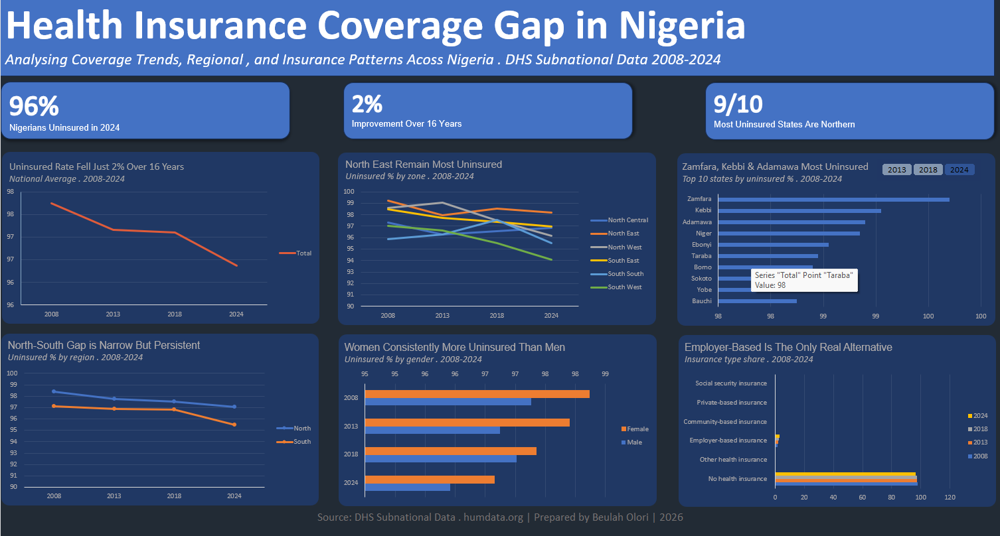

# 🏥 Health Insurance Coverage Gap in Nigeria
### A State-by-State Analysis Using DHS Subnational Data (2008–2024)

---

## 📋 Table of Contents
- [Executive Summary](#executive-summary)
- [Project Overview](#project-overview)
- [Data Source](#data-source)
- [Problem Statement](#problem-statement)
- [Tools and Methodology](#tools-and-methodology)
- [Exploratory Data Analysis](#exploratory-data-analysis)
- [Key Insights](#key-insights)
- [Dashboard Preview](#dashboard-preview)
- [Recommendations](#recommendations)
- [Limitations](#limitations)
- [Conclusion](#conclusion)

---

## Executive Summary

Nigeria has one of the lowest health insurance coverage rates in the world. Despite the establishment of the National Health Insurance Scheme (NHIS) in 2005, access to formal health coverage remains out of reach for the vast majority of Nigerians. This project analyses 16 years of DHS Subnational survey data (2008–2024) across all 36 states and FCT to uncover the scale, geography, and demographics of Nigeria's health insurance crisis.

The headline finding is stark: **96% of Nigerians remain uninsured in 2024** — down from just 98% in 2008. That is a 2% improvement over 16 years. At this pace, universal health coverage is more than a century away. This analysis reveals not just the scale of the problem, but where it is most severe, who it affects most, and why existing systems have failed to bridge the gap.

---

## Project Overview

This is an end-to-end Excel data analytics portfolio project covering data cleaning, pivot table analysis, dashboard design, and data storytelling. The project was built to answer 8 specific analytical questions about health insurance coverage in Nigeria using real-world subnational survey data.

**Project goals:**
- Analyse national trends in health insurance coverage from 2008 to 2024
- Identify which geopolitical zones and states are most underserved
- Examine whether a North-South divide exists in coverage
- Investigate the gender gap in insurance access
- Understand the composition of Nigeria's insurance landscape
- Produce a clean, insight-driven dashboard suitable for public health and NGO audiences

---

## Data Source

| Field | Detail |
|-------|--------|
| **Source** | DHS Subnational Data — [humdata.org](https://data.humdata.org) |
| **Coverage** | Nigeria — all 36 states + FCT Abuja |
| **Survey Waves** | 2008, 2013, 2018, 2024 |
| **Total Rows** | 2,148 |
| **Format** | Long format — each row = Location + Indicator + Gender + SurveyYear + Value |
| **Data as of** | 2024 DHS Survey Wave |

**Key columns:**
- `Location` — zone or state name
- `Indicator` — insurance type (No health insurance, Employer-based, NHIS, Community-based, Private, Social security)
- `Gender` — Female / Male
- `SurveyYear` — 2008, 2013, 2018, 2024
- `Value` — percentage of population
- `CharacteristicLabel` — detailed label for zone or state

---

## Problem Statement

Nigeria's National Health Insurance Scheme was established in 2005 with the goal of providing Nigerians with access to affordable healthcare through insurance. Nearly two decades later, the data tells a different story. Coverage has barely moved — from 98% uninsured in 2008 to 96% in 2024. Community-based schemes are near zero. Private insurance is effectively non-existent. Employer-based coverage sits at just 2–3%.

The consequences of this coverage gap are severe: Nigerians without insurance face catastrophic out-of-pocket health expenditures, delayed care, and avoidable deaths. The burden falls disproportionately on northern states, rural populations, and women. This project asks: where exactly is the gap, how wide is it, and has anything improved?

---

## Tools and Methodology

| Tool / Skill | Application |
|--------------|-------------|
| **Microsoft Excel** | Full project — data cleaning, analysis, dashboard |
| **Pivot Tables** | 6 pivot tables built from raw dataset |
| **Pivot Charts** | Line charts, horizontal bar charts, clustered bar chart |
| **IF Formulas** | Created `Level` and `Region` calculated columns |
| **Find & Replace** | Cleaned leading dot characters from state labels |
| **Data Validation** | Shortened long indicator names for readability |
| **Dashboard Design** | Dark navy theme, KPI cards, chart formatting, sheet protection |
| **Slicers** | Interactive year filter on underserved states chart |

**Analytical steps:**
1. Loaded raw DHS dataset into Excel as a named table: `HealthInsuranceData`
2. Added `Level` column: `=IF([@LevelRank]=1,"Zone","State")`
3. Added `Region` column: `=IF(LEFT(TRIM([Characteristic Label]),5)="North","North","South")`
4. Cleaned state name labels — removed leading dot characters using Find & Replace
5. Shortened long indicator names in raw data for chart readability
6. Built 6 pivot tables with filters applied in the Filters area — no slicers on pivot tables except PT4
7. Created 6 pivot charts linked to each pivot table
8. Designed dashboard on a dedicated sheet with dark navy theme
9. Formatted all chart areas, plot areas, axes, gridlines, and legends to match dark theme
10. Applied consistent chart sizing across all 6 charts
11. Added insight-driven titles and subtitles to every chart
12. Moved PT4 year slicer onto dashboard and styled it
13. Added 3 KPI cards, dashboard title, subtitle, and footer
14. Removed field buttons from all charts
15. Protected dashboard sheet — slicer is the only accessible interactive element

---

## Exploratory Data Analysis

Before building the dashboard, the dataset was explored to understand its structure and confirm data quality.

**Dataset structure:**
- Long format data with one row per location, indicator, gender, and survey year
- Covers zone-level and state-level data, distinguished by the `LevelRank` column
- Indicators cover 6 insurance types: No health insurance, Employer-based, NHIS/Social security, Community-based, Private, Other
- Gender split: Female and Male respondents captured separately

**Data quality observations:**
- State names had leading dot characters (e.g. `..Zamfara`) — cleaned using Find & Replace
- Some indicator labels were excessively long — shortened for chart readability
- No missing values found in key columns (Indicator, Value, SurveyYear, Level)
- FCT Abuja appears as a state within North Central zone — employer-based insurance in Abuja (~14%) is a notable outlier against the rest of the zone

**Key patterns identified during EDA:**
- The "No health insurance" indicator consistently sits at 94–100% across all zones and years
- Employer-based insurance is the only alternative with any meaningful presence (2–3%)
- All other insurance types are effectively at or near 0%
- North East and North West consistently show the highest uninsured rates
- South West shows the most improvement across the 16-year period

---

## Key Insights

| # | Insight |
|---|---------|
| 1 | **96% of Nigerians remain uninsured in 2024** — down from 98% in 2008 |
| 2 | **Only 2% improvement over 16 years** — at this pace, universal coverage is over a century away |
| 3 | **North East and North West are the most uninsured zones** — consistently at 98–99% across all 4 survey waves |
| 4 | **South West showed the most improvement** — dropping from 97% in 2008 to 94% in 2024, the only zone showing meaningful progress |
| 5 | **The North-South gap is only ~1 percentage point** — the coverage crisis is national, not just a northern problem |
| 6 | **9 of the 10 most underserved states are northern** — Zamfara leads at 100% uninsured in 2024, followed by Kebbi and Adamawa at 99% |
| 7 | **Women are consistently 1% more uninsured than men** — Female: 97–98%, Male: 96–97% across all years, and this gap has not narrowed |
| 8 | **Employer-based insurance is Nigeria's only real alternative** at 2–3% — private insurance, community schemes, and social security are all effectively at 0% |

---

## Dashboard Preview

**Dashboard features:**
- 3 headline KPI cards: 96% uninsured · 2% improvement · 9/10 northern states
- 6 pivot charts in a 3×2 grid
- 1 interactive year slicer on the underserved states chart (2013 / 2018 / 2024)
- Dark navy theme with coral, teal, and blue accent colors
- Insight-driven chart titles throughout
- Sheet protected — slicer is the only interactive element

---

## Recommendations

Based on the findings, the following recommendations are directed at policymakers, NGOs, and development sector organisations working in Nigeria:

1. **Target northern states with emergency coverage intervention** — With 9 of 10 most underserved states in the North, blanket national policy is insufficient. State-level insurance expansion programs with federal backing are needed in Zamfara, Kebbi, Adamawa, Niger, and Yobe specifically.

2. **Investigate and replicate the South West model** — South West is the only zone showing meaningful improvement (97% → 94%). Understanding what policy, economic, or demographic factors drove this improvement could inform interventions in other zones.

3. **Address the gender gap with targeted women's health insurance programs** — Women have been consistently 1% more uninsured than men for 16 years with no sign of convergence. Gender-sensitive insurance enrollment programs are needed.

4. **Expand employer-based insurance as a bridging strategy** — With formal insurance effectively non-existent, employer-based schemes at 2–3% are the only functioning alternative. Incentivising businesses, especially in the informal sector, to enroll employees could accelerate coverage expansion.

5. **Re-evaluate the NHIS model** — The near-zero uptake of NHIS and community-based schemes after nearly 20 years indicates a fundamental failure of design, awareness, or accessibility. A structural review is overdue.

---

## Limitations

1. **Survey-based data** — DHS data is collected through household surveys. Results reflect respondent self-reporting and may not capture informal or partially insured individuals accurately.

2. **Only 4 data points over 16 years** — With survey waves in 2008, 2013, 2018, and 2024, it is impossible to detect year-on-year changes or identify the exact timing of any improvements or setbacks.

3. **Gender coverage is incomplete** — The 2008 survey wave captured zone-level data only. State-level gender breakdowns are available from 2013 onwards, which limits historical state-level gender comparisons.

4. **FCT Abuja outlier effect** — Abuja's employer-based insurance rate (~14%) is significantly higher than the rest of North Central states. Being averaged into the North Central zone figure may understate the coverage gap in non-Abuja North Central states.

5. **No population weighting in pivot averages** — Pivot table averages treat all zones and states equally regardless of population size. A weighted average by population would produce slightly different national figures.

---

## Conclusion

Nigeria's health insurance crisis is not a new story — but the data makes it impossible to ignore. After 16 years and 4 national surveys, the country has moved from 98% uninsured to 96% uninsured. Two percentage points. The formal insurance system has not meaningfully reached most Nigerians, community-based alternatives have failed to scale, and the burden falls hardest on northern states and women.

The data does not suggest that progress is impossible — South West's improvement from 97% to 94% shows that change can happen. But the current pace and approach are not sufficient to address a crisis of this scale. Without targeted geographic intervention, gender-sensitive programs, and a fundamental rethink of how insurance is delivered in Nigeria, universal health coverage will remain out of reach for the foreseeable future.

---

## 📁 Files in This Repository

| File | Description |
|------|-------------|
| `health-insurance_subnational_nga.xlsx` | Full Excel workbook — Raw Data, Analysis, and Dashboard sheets |
| `health-insurance-dashboard.png` | Clean screenshot of the completed dashboard |
| `README.md` | This file |

---

## 📝 Data Citation

> DHS Program. *Nigeria DHS Subnational Data 2008–2024.* Retrieved from [humdata.org](https://data.humdata.org). The DHS Program is funded by the United States Agency for International Development (USAID).

---

*Prepared by Beulah Shineth · 2026*
